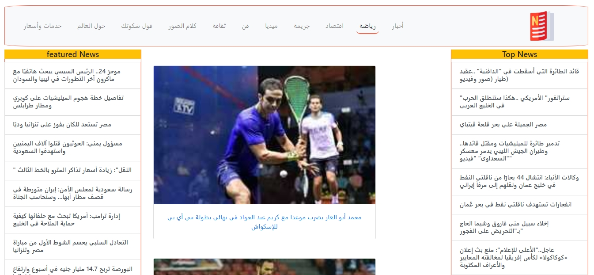
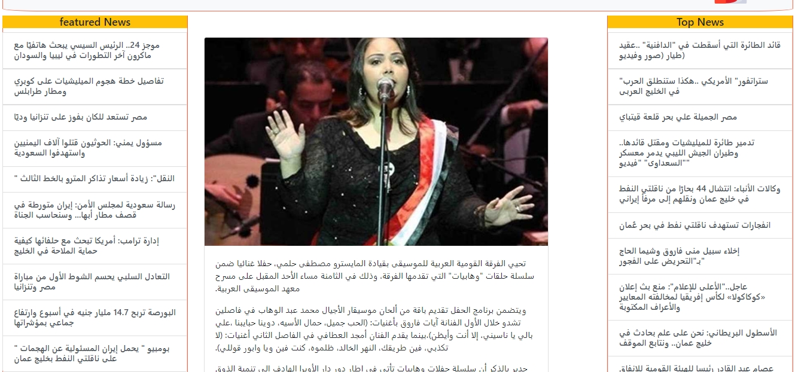

# Rosa El-youssef

Is a simple News-feed website for rosa-elyoussef magazine made using Angula7, Bootstrap and an updated API.

This project was generated with [Angular CLI](https://github.com/angular/angular-cli) version 7.3.8.

## Notes

This project was made as a part of the Information technology institute (ITI) 3 months program.

## Screenshots

